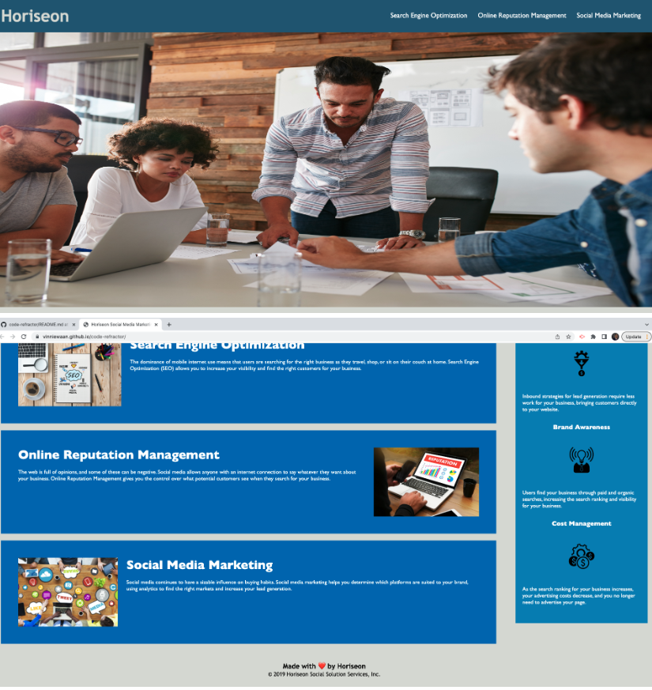

# Code Refractor
 
## Table of Contents

- [Description](#Description)
- [Usage](#usage)
- [Credits](#credits)
- [Badges](#Badges)

## Description

Assignment: 02-Challenge Coding Boot Camp 

Task:
- Refactor existing code
- Make code more accessible by adding alt attributes icon and image elements
- Consolidate and reorganize code for a cleaner look
- Create acceptable ReadMe file
- Site is optimized for search engine
- Use semantic HTML elements
- Elements follow a logical structure
- Heading attributes fall in sequential order
- Concise, descriptive title

Lessons Learned:
- Completed all of the above tasks
- Created remote repo and cloned it to local machine
- Used the git commands to save and push to remote repo
- Deployed the application (See Usage)
- CSS file commented
- Repo has a unique name

## Usage

Launch live site at [https://vinniewaan.github.io/code-refractor-main/](https://vinniewaan.github.io/code-refractor-main/) 

## Credits

[Vinnie Waan](https://github.com/VinnieWaan/)

## Badges

